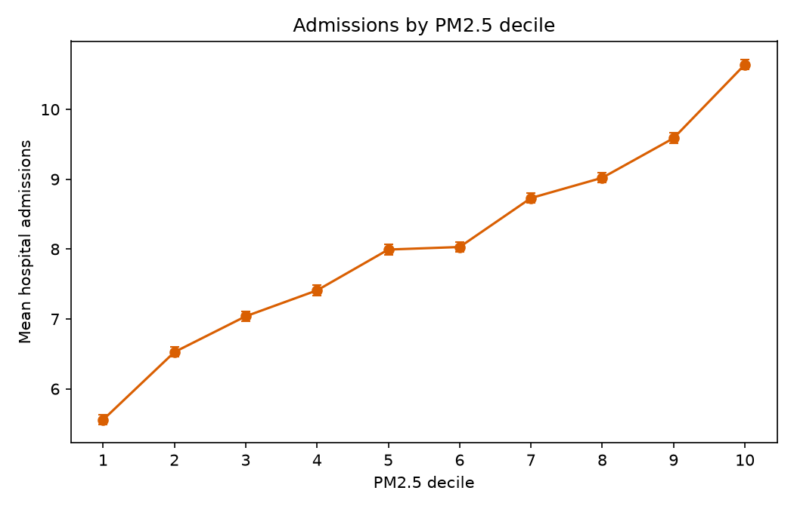
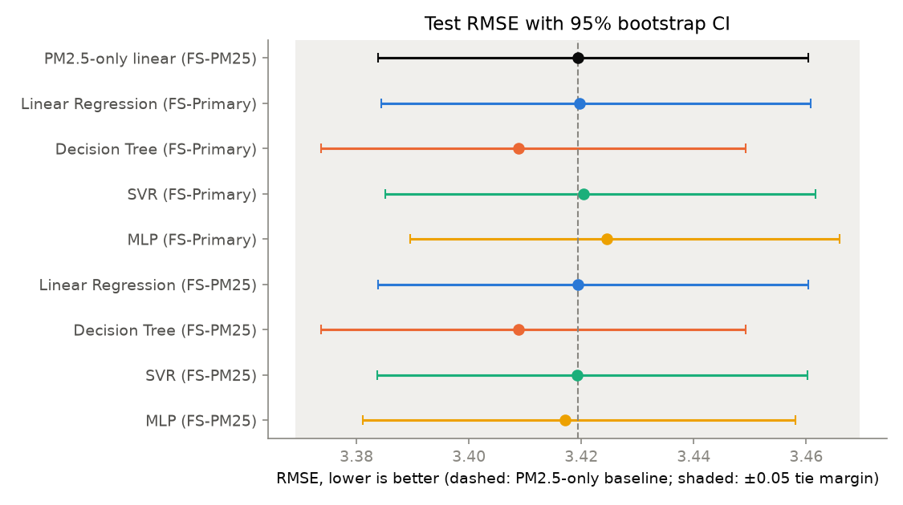
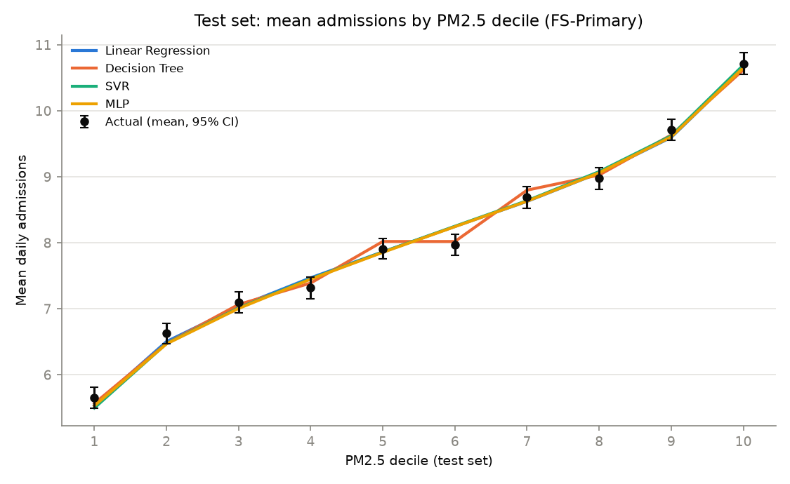
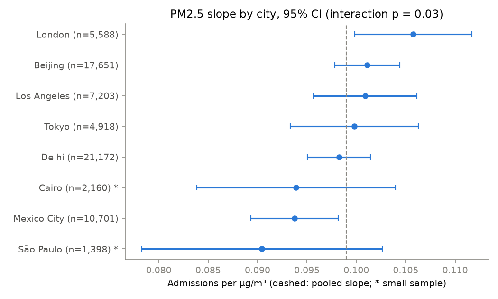
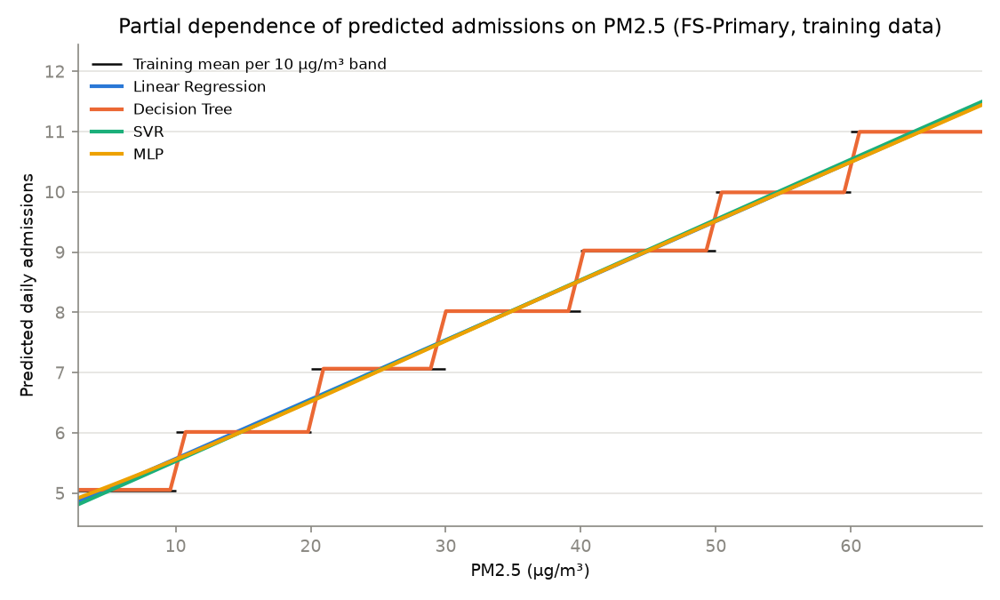
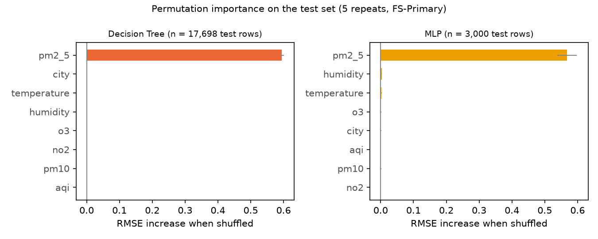

# Predicting Respiratory Hospital Admissions from Air Quality: A Multi-City Comparison of Linear, Tree, SVM and Neural-Network Models

*Data Mining course project. Every number below comes from `results/` (FULL runs, 2026-10-01). A plain-language summary with the model comparison table is in [RESULTS_SUMMARY.md](RESULTS_SUMMARY.md).*

> **Synthetic-data disclosure.** The dataset (*Global Air Quality and Respiratory Health Outcomes*, Kaggle) is **synthetic**. Our audit (Section 3) shows it was generated by a program:
> - its dates are a counter running from 2020 to 2262
> - all eight cities have identical pollution profiles
> - the PM2.5 effect is an exact staircase in steps of 10 µg/m³
>
> **This report studies how prediction models behave on a known benchmark. It makes no claim about real health effects of air pollution, and nothing here should be quoted as evidence about any real city.**

---

## Abstract
We predicted daily respiratory hospital admissions (regression) and high-admission "spike" days (classification) for eight cities (88,489 days), from PM2.5, PM10, NO₂, O₃, AQI, temperature, humidity and city. We compared Linear/Logistic Regression, a Decision Tree, an RBF Support Vector Machine and a multilayer perceptron (MLP).

- **Method:** each model was tuned with 5-fold cross-validation on 80% of the data, following established guidance for that model. All were then judged **once** on a held-out 20% test set, with 95% bootstrap confidence intervals and a tie margin fixed in advance.
- **Every model tied.** Test RMSE was 3.41–3.42 admissions and R² ≈ 0.15, the same as a straight line on PM2.5 alone (RMSE 3.419). That is the ceiling set by the data: PM2.5 is its only signal (r = 0.39).
- **H1 is supported:** PM2.5 alone predicts as well as all inputs.
- **Cities behaved identically:** per-city models never beat a pooled model.
- **Spike days** were flagged better than chance (PR-AUC 0.25 vs 0.12) but weakly (F1 ≈ 0.31).
- **The one detectable difference,** a 0.011 RMSE edge for the Decision Tree, is explained by a staircase-shaped PM2.5 effect that trees represent exactly.

The result supports the literature's finding that flexible models add little when the signal is simple, and it shows the evaluation practices that make such a negative result trustworthy.

---

## 1. Introduction
Short-term exposure to fine particulate matter (PM2.5) is associated with increased respiratory hospital admissions (Wong et al., 1999; Dominici et al., 2006; WHO, 2021). Hospitals could use a reliable forecast of busy days for staffing and capacity planning. Machine-learning models are often proposed for this; whether they beat simpler statistical models is an open, frequently tested question (Section 2.2).

The original proposal compared Delhi (high pollution) with London (low pollution) and planned time-series features and Prophet. A data audit before modelling showed that this dataset supports neither (Section 3), so the project became a careful **model-comparison study on a benchmark with a known simple structure**.

| | Research question |
|---|---|
| **RQ1** | Which model (Linear Regression, Decision Tree, SVM, MLP) best predicts daily respiratory admissions? |
| **RQ2** | Do model performance, or the pollution–admissions relationship, differ across cities? |
| **RQ3** | Which features drive the predictions? |
| **RQ4** | Can the models flag high-admission ("spike") days? |
| **H1** | PM2.5 alone predicts about as well as all features. |

## 2. Literature review

### 2.1 Air pollution and respiratory admissions
**How the effect is usually studied.** Epidemiology estimates the effect of daily pollution on admissions mostly with time-series regression on real daily counts, controlling for season, weather and delayed effects:
- Wong et al. (1999) found associations between pollutants and respiratory admissions in Hong Kong.
- Dominici et al. (2006) analysed hospital admissions of US Medicare enrollees and found increases in respiratory admissions associated with same-day PM2.5. The effects were small: a few percent at most per 10 µg/m³.
- The WHO 2021 guidelines summarise the evidence as roughly linear, with no safe threshold, at the concentrations studied.

**Three features of real data:**
1. **Small effects:** single-digit percentages per 10 µg/m³.
2. **Smooth curves** relating concentration to risk.
3. **Time structure:** delayed effects, seasonality, and persistence from one day to the next.

These give us the yardstick against which our dataset is judged in Section 3.

### 2.2 Machine learning vs simple models
**Simple models are often enough.** Several studies found little gain from complex models:
- Holte (1993) showed that very simple classification rules perform close to complex ones on many common benchmark datasets.
- Hand (2006) argued that much reported progress in classifier technology is illusory in practice. Simple models capture most of the predictable signal, and the remaining gains are often smaller than the uncertainty in real problems.
- In health specifically, Christodoulou et al. (2019) systematically reviewed clinical prediction studies and found **no performance benefit** of machine learning over logistic regression when comparisons were fair.

**Theory explains why.** When most of the outcome's variation is noise that no input can explain, no model can exceed the explainable share (Hastie, Tibshirani & Friedman, 2009). Extra flexibility then only adds variance.

**Specific model-family results relevant here:**
- An RBF-kernel SVM becomes nearly linear as its kernel width parameter gamma shrinks (Keerthi & Lin, 2003).
- Decision trees approximate smooth relationships with steps but represent step functions exactly (Breiman et al., 1984).
- Ranking metrics such as ROC-AUC and PR-AUC don't change under any score transformation that preserves order (Fawcett, 2006).

### 2.3 Evaluating model comparisons fairly
The literature identifies several common pitfalls and their remedies, which this project follows:
- **Information leakage** from preprocessing or thresholds fitted on test data. Remedy: fit everything on training folds only (Hastie et al., 2009, §7.10.2).
- **Optimistic tuning scores.** The best of many cross-validated configurations overstates true performance. Remedy: judge on an untouched test set (Cawley & Talbot, 2010).
- **Uneven tuning effort**, which can make one model look worse simply because it was searched less. The search budget follows Bergstra & Bengio (2012); the SVM procedure follows Hsu, Chang & Lin (2003) and Cherkassky & Ma (2004).
- **Misleading metrics for rare outcomes.** Accuracy and ROC-AUC can flatter a classifier when positives are rare, so PR-AUC is preferred (Saito & Rehmsmeier, 2015).
- **Uncertainty:** bootstrap confidence intervals (Efron & Tibshirani, 1993), and robust standard errors for regression coefficients (MacKinnon & White, 1985).

### 2.4 How this project fits
This project tests the Section 2.2 claims (flexible models add little when the signal is simple) on a dataset whose structure we could audit completely, using the Section 2.3 practices so that a "no difference" result cannot be blamed on leakage, under-tuning or optimistic scoring.

## 3. Data and audit
- **Size:** 88,489 rows and 12 columns. Validation checks all pass, and there are no missing values or duplicates.
- **Target:** `hospital_admissions`, a daily count from 0 to 25 (mean 8.05, variance 13.80).
- **Audit findings** (full detail in `docs/DATA_AUDIT.md`):

| Finding | Consequence |
|---|---|
| All 88,489 dates are unique: one per day from 2020 to 2262, with cities scattered randomly. Autocorrelation ≈ 0. | No time series exists. Rows are independent, so a random split is valid. Prophet and lag features were dropped. |
| PM2.5 correlates with admissions at r = 0.392; every other variable has \|r\| < 0.005. AQI is unrelated to PM2.5 (r = 0.003). | One signal: the best possible R² ≈ 0.154. |
| All cities have mean PM2.5 ≈ 35 and mean admissions ≈ 8.0. | "High- vs low-pollution city" can't be tested. |
| The PM2.5 effect is a staircase: mean admissions ≈ 5.05 + 0.99 × floor(PM2.5/10). Found in Step 12. | About +12% admissions per 10 µg/m³, in steps. Compared with Section 2.1 (a few percent at most, smooth, time structure), this is far too large, step-shaped, and has no time structure: further evidence of generated data. |

## 4. Methodology
The executed methodology, with results for every step, is in `docs/METHODOLOGY.md`; the rules are in `docs/PROJECT_RULES.md`; every decision is in `docs/DECISIONS_LOG.md`.

1. **Spike label:** admissions ≥ 13, the 90th percentile of the **training** set. 11.7% of days are spikes.
2. **Feature sets:**
   - **FS-Primary:** AQI, PM2.5, PM10, NO₂, O₃, temperature, humidity and city (one-hot).
   - **FS-PM25:** PM2.5 only. Comparing the two tests H1.
3. **Split:** 80/20, stratified by city × spike, seed 42 (70,791 / 17,698 rows). **The test set was read only by the final evaluation script,** after every choice had been fixed.
4. **Baselines,** scored with 5-fold CV on the folds every model shares: the mean, the per-city mean, a PM2.5-only line, and spike prevalence.
5. **Models and tuning** (5-fold CV, training data only). Selection is by RMSE for regression and PR-AUC for spikes. Search sizes follow Bergstra & Bengio (2012): at least 10 random draws for regression and at least 30 for classification, with full grids for the cheap models. A range whose best value sits on its edge is widened once.

   | Model | Tuning | Basis |
   |---|---|---|
   | Ridge / Logistic | Full grid over penalty strength; inputs standardised | Hoerl & Kennard (1970) |
   | Decision Tree | Full grid over depth × leaf size × pruning strengths taken from the training pruning path | Breiman et al. (1984) |
   | SVM (RBF) | Coarse-to-fine random search (40 × 5 folds on 10k rows, then 20 × 5 on 20k rows); epsilon tied to the noise level; learning curve 5k–40k; final fit on 20k (curve flat) | Hsu et al. (2003); Cherkassky & Ma (2004); Chang & Lin (2011) |
   | MLP | Random search over 3 sizes × L2 penalty × learning rate; early stopping (regressor); 5 seeds | Goodfellow et al. (2016) |

6. **Final test** (once): RMSE, MAE, R² and Poisson deviance; PR-AUC and ROC-AUC.
   - 95% CIs from 1,000 bootstrap resamples, with model comparisons on the same resampled rows (paired).
   - **Rule fixed in advance:** two models differ only if the RMSE gap is ≥ 0.05 **and** the CI excludes 0.
   - **Leakage alarm** at test R² > 0.20.
7. **Cities:** pooled vs per-city models (each per-city model tuned on its own city's training rows), and OLS PM2.5 × city slopes with robust SEs.
8. **Spike thresholds:** each maximises F1 on out-of-fold **training** predictions, then is applied once to the test scores.
9. **Interpretation:** permutation importance on the test set (Breiman, 2001), partial dependence (Friedman, 2001), standardised coefficients, and the tree's structure.

## 5. Results

### 5.1 Baselines and cross-validation (training data)
- **Baselines** (CV RMSE): mean 3.716; city mean 3.716 (city adds nothing); PM2.5-only line **3.417** (R² 0.154). Spike prevalence: PR-AUC 0.117.
- **Tuned models** (CV RMSE, FS-Primary / FS-PM25): Ridge 3.418 / 3.417; Tree 3.408 / 3.408; SVR 3.419 / 3.417 (fixed-setting score); MLP 3.423 / 3.416 (5-seed mean).
- **Spike PR-AUC** (CV): Logistic 0.240; Tree 0.227 / 0.232; SVC 0.239; MLP 0.235 / 0.240.

### 5.2 RQ1: test-set regression

| Model (FS-Primary) | RMSE [95% CI] | MAE | R² | Paired Δ vs Linear [95% CI] | Verdict |
|---|---|---|---|---|---|
| Mean predictor | 3.714 [3.675, 3.751] | 2.946 | 0.000 | +0.294 [0.271, 0.313] | worse |
| PM2.5-only line | 3.419 [3.384, 3.460] | 2.717 | 0.152 | −0.0004 [−0.0010, 0.0003] | tie |
| Linear (Ridge) | 3.420 [3.384, 3.461] | 2.717 | 0.152 | – | – |
| Decision Tree | 3.409 [3.374, 3.449] | 2.691 | 0.157 | −0.011 [−0.015, −0.006] | tie |
| SVR | 3.420 [3.385, 3.462] | 2.718 | 0.152 | +0.001 [−0.000, 0.002] | tie |
| MLP (5 seeds) | 3.425 [3.390, 3.466] | 2.721 | 0.150 | +0.005 [0.003, 0.007] | tie |

- **Every model sits at the theoretical ceiling** (R² ≈ 0.15) and ties with the one-feature baseline.
- **The tree's edge is statistically real** (it also appeared in CV) but is five times smaller than the tie margin.
- **No leakage alarm fired.**

### 5.3 H1: PM2.5 alone vs all features (test)

| Model | FS-Primary | FS-PM25 | Difference [95% CI] |
|---|---|---|---|
| Linear (RMSE) | 3.4197 | 3.4193 | +0.0004 [−0.0003, 0.0010] |
| Tree (RMSE) | 3.4089 | 3.4089 | 0 (it splits only on PM2.5) |
| SVR (RMSE) | 3.4204 | 3.4192 | +0.0012 [0.0001, 0.0023] |
| MLP (RMSE) | 3.4245 | 3.4171 | +0.0074 [0.0050, 0.0097] |
| Logistic (PR-AUC) | 0.2492 | 0.2490 | +0.0002 [−0.0006, 0.0010] |

**H1 is supported.** Extra inputs never help. For the MLP they slightly hurt, because it fits a little noise from them.

### 5.4 RQ2: cities
- **Pooled vs per-city (test).** No city gains from its own model.
  - Weighted over all test rows: Linear Δ = +0.0005 [−0.0007, 0.0017]; Tree Δ = +0.0065 [0.0031, 0.0102]. Both ties.
  - Pooling helps the tree slightly, because each split is estimated from more data.
- **Slopes (training data, robust SEs).**
  - The slopes range from 0.090 (São Paulo) to 0.106 (London) admissions per µg/m³; pooled 0.099 [0.097, 0.101].
  - Whether slopes differ by city: Wald χ²(7) = 15.7, p = 0.028. London vs Delhi: +0.0075, p = 0.028. Both unadjusted.
  - These small, detectable differences don't improve prediction. They may partly come from fitting a straight line to a staircase.

### 5.5 RQ4: spike early warning (test)

| Model (FS-Primary) | PR-AUC | ROC-AUC | Days flagged | Precision | Recall | F1 [95% CI] |
|---|---|---|---|---|---|---|
| Flag every day | 0.117 | 0.500 | 100% | 0.117 | 1.000 | 0.209 [0.201, 0.217] |
| Logistic | 0.249 | 0.713 | 26% | 0.227 | 0.511 | 0.314 [0.300, 0.329] |
| Decision Tree | 0.238 | 0.708 | 28% | 0.221 | 0.524 | 0.311 [0.296, 0.324] |
| SVC | 0.249 | 0.713 | 46% | 0.185 | 0.728 | 0.295 [0.284, 0.307] |
| MLP | 0.247 | 0.711 | 29% | 0.221 | 0.539 | 0.313 [0.299, 0.328] |

- **Ranking is identical across models.** Logistic, SVC and MLP order days by PM2.5, so they share the same PR-AUC (Fawcett, 2006).
- **The tree ranks slightly worse,** because it groups days into steps that share one score.
- **The practical rule is weak.** Catching half of the spike days requires flagging about 28% of days, and only about 1 flagged day in 4.5 is a real spike.
- **Spike risk by PM2.5 band:** about 3% below 20 µg/m³, 6% at 20–30, 10% at 30–40, 15% at 40–50, 22% at 50–60, and 30–44% above 60.
- **The SVC flags more days** because its uncalibrated score scale shifts when the final model is refit.
- **Class weighting changes nothing** (F1 0.317).

### 5.6 RQ3: what drives predictions
- **Permutation importance (test):** shuffling PM2.5 raises RMSE by 0.595 (tree) and 0.568 (MLP). Every other input changes it by ≤ 0.003.
- **Standardised OLS:** PM2.5 = 1.46 admissions per SD [1.435, 1.485]. All other CIs include 0, except one city term (Beijing, p = 0.03), which is about what chance gives across 13 tests.
- **Partial dependence:** Linear, SVR and MLP learn the same straight line; the tree traces a 10 µg/m³ staircase.
- **The staircase is real:** a staircase model beats a straight line in CV (RMSE 3.4065 vs 3.4171), only steps of exactly 10 work, and the tree's splits fall at 10, 20, …, 60.

## 6. Discussion

### 6.1 Why every model ties, and why the tree edges ahead
- **The ceiling.** With one signal at r ≈ 0.39, about 85% of the variance is noise no model can predict, so every reasonable model converges on R² ≈ 0.15 (Hastie et al., 2009).
- **The flexible models found nothing more.** The SVM and MLP rediscovered the straight line: the SVM chose a near-linear kernel (Keerthi & Lin, 2003), and the MLP's partial dependence matches the line.
- **The tree's small gain comes from the staircase,** which trees represent exactly (Breiman et al., 1984).
- **This matches the literature:** simple models capture almost all of the predictable signal (Holte, 1993; Hand, 2006), and in health prediction machine learning shows no benefit over logistic regression in fair comparisons (Christodoulou et al., 2019).

### 6.2 Is the result meaningful?
**Yes, in the sense a data mining project should be judged.**
1. **The negative result is trustworthy.** Every safeguard in Section 2.3 was applied:
   - no leakage
   - one untouched test
   - paired CIs
   - a tie margin fixed in advance
   - thorough, literature-based tuning, with searches enlarged after we measured a 1-in-4 risk that 10 random draws would under-tune the classifiers

   So "all models tie" is a finding, not a failure to tune.
2. **It is explained, not just observed.** Theory predicted the ceiling, the near-linear SVM, the identical PR-AUCs and the tree's small edge, and each prediction was confirmed.
3. **The audit was itself a finding.** It showed that the data cannot support the proposal's original real-world claims, and why.

**But it is not a real-world health finding.** The data is synthetic, with an effect far larger than in real epidemiology (Section 2.1), steps instead of a smooth curve, and no time structure. None of the numbers say anything about real cities or real pollution.

### 6.3 Limitations
- **Synthetic data:** no external validity.
- **Lean scope:** two feature sets only. Not done: repeated CV, robustness checks, leave-one-city-out, the Poisson GLM, VIF, a real-data comparison, and Holm correction (so city p-values are unadjusted).
- **SVM:** trained on a 20k-row subsample, justified by a flat learning curve. Its spike threshold transferred less well, because no probability calibration was used (a compute constraint).
- **MLP classifier:** it stopped on training loss rather than validation loss, because sklearn's classifier early stopping uses accuracy, which is uninformative at 11.7% prevalence.
- **Post-test discovery:** the staircase was found on training data after the test evaluation. No model was rebuilt and re-scored on the test set.
- **The audit described all rows, test rows included.** It was descriptive only; no setting was chosen from it.

## 7. Conclusion
On this benchmark, a straight line on PM2.5 predicts respiratory admissions as well as a tuned Decision Tree, SVM or neural network. PM2.5 alone is as good as all inputs, cities share one relationship, and spike warnings beat chance but are weak. The project's contribution is the process that makes this conclusion credible: auditing the data before modelling, comparing against simple baselines, tuning every model fairly by the literature, and judging all models once on an untouched test set with confidence intervals.

---

## References
- Bergstra, J., & Bengio, Y. (2012). Random search for hyper-parameter optimization. *JMLR*, 13, 281–305. https://jmlr.org/papers/v13/bergstra12a.html
- Breiman, L. (2001). Random forests. *Machine Learning*, 45, 5–32. https://doi.org/10.1023/A:1010933404324
- Breiman, L., Friedman, J., Olshen, R., & Stone, C. (1984). *Classification and Regression Trees*. Wadsworth (reprinted CRC Press). https://doi.org/10.1201/9781315139470
- Cawley, G. C., & Talbot, N. L. C. (2010). On over-fitting in model selection and subsequent selection bias in performance evaluation. *JMLR*, 11, 2079–2107. https://jmlr.org/papers/v11/cawley10a.html
- Chang, C.-C., & Lin, C.-J. (2011). LIBSVM: A library for support vector machines. *ACM TIST*, 2(3), 27. https://doi.org/10.1145/1961189.1961199
- Cherkassky, V., & Ma, Y. (2004). Practical selection of SVM parameters and noise estimation for SVM regression. *Neural Networks*, 17(1), 113–126. https://doi.org/10.1016/S0893-6080(03)00169-2
- Christodoulou, E., et al. (2019). A systematic review shows no performance benefit of machine learning over logistic regression for clinical prediction models. *Journal of Clinical Epidemiology*, 110, 12–22. https://doi.org/10.1016/j.jclinepi.2019.02.004
- Cortes, C., & Vapnik, V. (1995). Support-vector networks. *Machine Learning*, 20, 273–297. https://doi.org/10.1007/BF00994018
- Dominici, F., et al. (2006). Fine particulate air pollution and hospital admission for cardiovascular and respiratory diseases. *JAMA*, 295(10), 1127–1134. https://doi.org/10.1001/jama.295.10.1127
- Efron, B., & Tibshirani, R. J. (1993). *An Introduction to the Bootstrap*. Chapman & Hall. https://doi.org/10.1201/9780429246593
- Fawcett, T. (2006). An introduction to ROC analysis. *Pattern Recognition Letters*, 27(8), 861–874. https://doi.org/10.1016/j.patrec.2005.10.010
- Friedman, J. H. (2001). Greedy function approximation: A gradient boosting machine. *Annals of Statistics*, 29(5), 1189–1232. https://doi.org/10.1214/aos/1013203451
- Goodfellow, I., Bengio, Y., & Courville, A. (2016). *Deep Learning*. MIT Press. https://www.deeplearningbook.org
- Hand, D. J. (2006). Classifier technology and the illusion of progress. *Statistical Science*, 21(1), 1–14. https://doi.org/10.1214/088342306000000060
- Hastie, T., Tibshirani, R., & Friedman, J. (2009). *The Elements of Statistical Learning* (2nd ed.). Springer. https://doi.org/10.1007/978-0-387-84858-7
- Hoerl, A. E., & Kennard, R. W. (1970). Ridge regression: Biased estimation for nonorthogonal problems. *Technometrics*, 12(1), 55–67. https://doi.org/10.1080/00401706.1970.10488634
- Holte, R. C. (1993). Very simple classification rules perform well on most commonly used datasets. *Machine Learning*, 11, 63–90. https://doi.org/10.1023/A:1022631118932
- Hsu, C.-W., Chang, C.-C., & Lin, C.-J. (2003). *A Practical Guide to Support Vector Classification*. National Taiwan University. https://www.csie.ntu.edu.tw/~cjlin/papers/guide/guide.pdf
- Keerthi, S. S., & Lin, C.-J. (2003). Asymptotic behaviors of support vector machines with Gaussian kernel. *Neural Computation*, 15(7), 1667–1689. https://doi.org/10.1162/089976603321891855
- Kohavi, R. (1995). A study of cross-validation and bootstrap for accuracy estimation and model selection. *Proceedings of IJCAI*, 1137–1143. https://www.ijcai.org/Proceedings/95-2/Papers/016.pdf
- MacKinnon, J. G., & White, H. (1985). Some heteroskedasticity-consistent covariance matrix estimators with improved finite sample properties. *Journal of Econometrics*, 29(3), 305–325. https://doi.org/10.1016/0304-4076(85)90158-7
- Pedregosa, F., et al. (2011). Scikit-learn: Machine learning in Python. *JMLR*, 12, 2825–2830. https://jmlr.org/papers/v12/pedregosa11a.html
- Provost, F., & Domingos, P. (2003). Tree induction for probability-based ranking. *Machine Learning*, 52(3), 199–215. https://doi.org/10.1023/A:1024099825458
- Saito, T., & Rehmsmeier, M. (2015). The precision-recall plot is more informative than the ROC plot when evaluating binary classifiers on imbalanced datasets. *PLoS ONE*, 10(3), e0118432. https://doi.org/10.1371/journal.pone.0118432
- Wong, T. W., et al. (1999). Air pollution and hospital admissions for respiratory and cardiovascular diseases in Hong Kong. *Occupational and Environmental Medicine*, 56(10), 679–683. https://doi.org/10.1136/oem.56.10.679
- World Health Organization (2021). *WHO Global Air Quality Guidelines*. https://www.who.int/publications/i/item/9789240034228
- Dataset: *Global Air Quality and Respiratory Health Outcomes*. Kaggle. https://www.kaggle.com/datasets/tfisthis/global-air-quality-and-respiratory-health-outcomes

## Appendix: reproducing and inspecting the work
- **No retraining is needed** to inspect any result. Tables, figures and trained models are saved in `results/`.
- **To rerun on another computer,** follow `docs/PROJECT_RULES.md`, Part 2 (about 4.5 h on the project laptop).
- **Step-by-step detail with every intermediate result:** `docs/METHODOLOGY.md`.
- **Dated log of all runs:** `results/logs/` (one output, error and progress file per FULL run).
